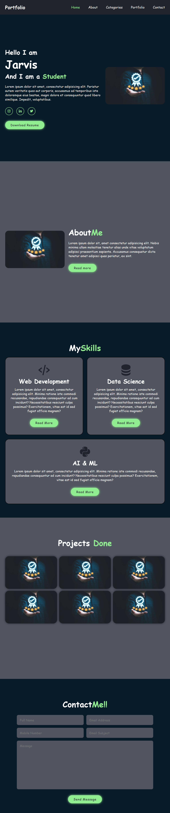
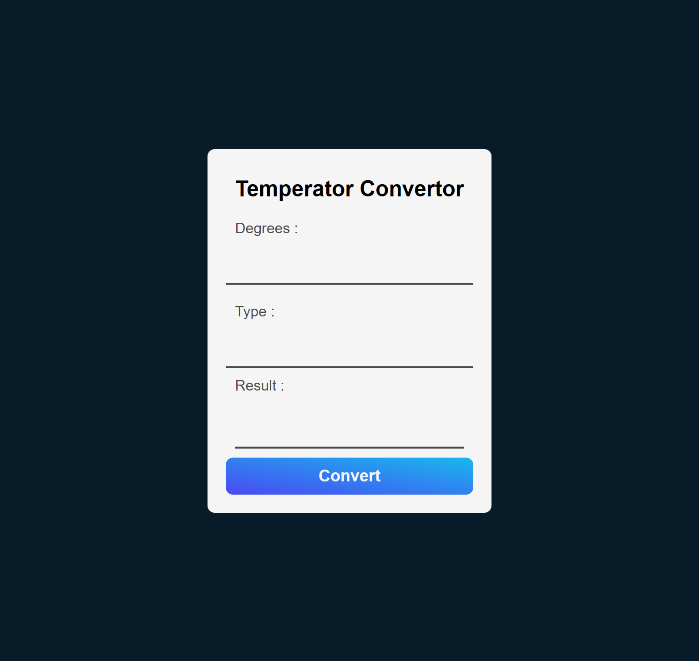
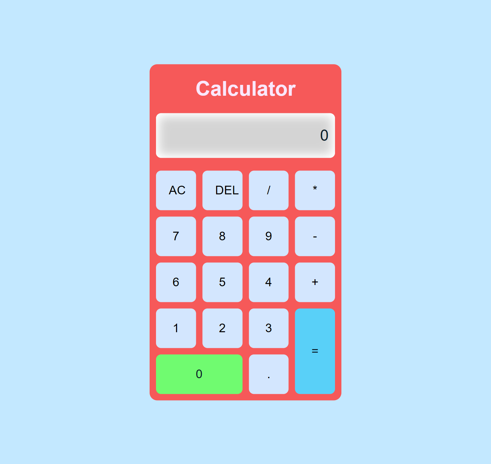
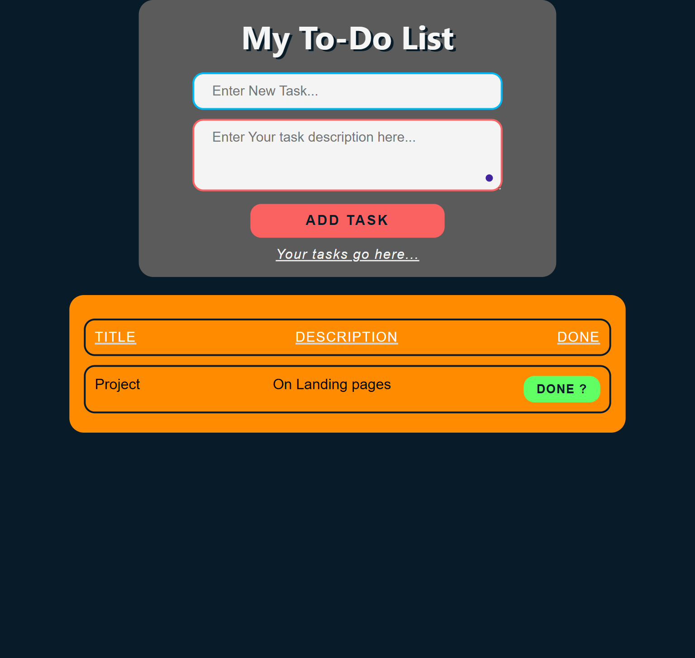

# Project List

| Project Name                | Live Demo                                |
| --------------------------- | ---------------------------------------- |
| L1T1 - LandingPage          | [Live Demo](https://arise-aizen-404.github.io/OasisInfoByte-Internship/L1T1%20-%20LandingPage/)          |
| L1T2 - Portfolio            | [Live Demo](https://arise-aizen-404.github.io/OasisInfoByte-Internship/L1T2%20-%20Portfolio/)             |
| L1T3 - TemperatureConvertor | [Live Demo](https://arise-aizen-404.github.io/OasisInfoByte-Internship/L1T3%20-%20TemperatureConvertor/) |
| L2T1 - Calculator           | [Live Demo](https://arise-aizen-404.github.io/OasisInfoByte-Internship/L2T1%20-%20Calculator/)            |
| L2T2 - TributePage          | [Live Demo](https://arise-aizen-404.github.io/OasisInfoByte-Internship/L2T2%20-%20TributePage/)          |
| L2T3 - TODOList             | [Live Demo](https://arise-aizen-404.github.io/OasisInfoByte-Internship/L2T3%20-%20TODOList/)             |

---

## L1T1 - LandingPage

This project is a simple landing page showcasing a product or service. It provides users with essential information about the product/service and encourages them to take action, such as signing up or exploring further.

### Description

The LandingPage project aims to create an engaging and visually appealing landing page that effectively communicates the value proposition of the product or service. It utilizes modern design principles and user experience techniques to capture and retain the user's attention.

### Output

---

## L1T2 - Portfolio

The Portfolio project is a personal portfolio website showcasing the creator's work, skills, and experiences. It serves as a professional representation of the individual and helps them establish an online presence.

### Description

The Portfolio project focuses on creating a visually stunning and user-friendly website that effectively highlights the creator's portfolio pieces. It includes sections such as About Me, Portfolio Gallery, Resume/CV, and Contact Information to provide visitors with comprehensive information about the creator's skills and expertise.

### Output

---

## L1T3 - TemperatureConvertor

The Temperature Converter project is a simple tool that allows users to convert temperatures between different units, such as Celsius, Fahrenheit, and Kelvin. It provides a convenient way for users to perform temperature conversions quickly and accurately.

### Description

The Temperature Converter project aims to create an intuitive and easy-to-use interface for users to input a temperature value in one unit and instantly see the equivalent value in other units. It employs basic mathematical formulas to perform the conversions and ensures accuracy in the results displayed to the users.

### Output

---

## L2T1 - Calculator

The Calculator project is a basic arithmetic calculator that allows users to perform various mathematical operations, such as addition, subtraction, multiplication, and division. It provides a handy tool for users to perform quick calculations without the need for a physical calculator.

### Description

The Calculator project focuses on creating a functional and user-friendly calculator interface that mimics the behavior of a traditional handheld calculator. It includes standard arithmetic operators and follows the order of operations to ensure accurate calculation results.

### Output

---

## L2T2 - TributePage

The Tribute Page project is a simple webpage dedicated to honoring and commemorating a person, group, or event. It provides users with information about the subject of tribute and highlights their achievements, contributions, or significance.

### Description

The Tribute Page project aims to create a visually appealing and informative webpage that pays tribute to its subject in a respectful manner. It includes sections such as Biography, Accomplishments, and Quotes to provide users with a comprehensive understanding of the subject's importance and impact.

### Output

---

## L2T3 - TODOList

The TODO List project is a task management tool that allows users to create, organize, and track their tasks and to-dos effectively. It provides users with a centralized platform to manage their daily activities and stay organized.

### Description

The TODO List project focuses on creating a simple and intuitive interface for users to add, edit, and delete tasks as needed. It includes features such as task categorization, priority levels, and due dates to help users prioritize and manage their tasks efficiently.

### Output

Copyright © [2024] [arise-aizen](https://github.com/arise-aizen-404).

This repository contains various projects created by [arise-aizen](https://github.com/arise-aizen-404). These projects are provided for educational and demonstration purposes only. You are welcome to explore, modify, and use the code for your own projects as per the terms of the license agreement. However, please refrain from using the projects for commercial purposes without proper attribution.

For inquiries or collaborations, please contact [maheshmahesh6336.6336@gmail.com].
